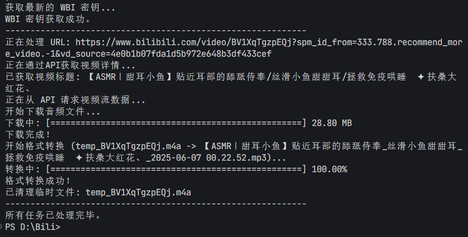

# Bilibili 音频下载器

这是一个基于 Python 的命令行工具，旨在帮助用户方便地从 Bilibili (B站) 视频中提取音频，并将其保存为通用的 MP3 格式。

该脚本会自动解析视频链接，选择非登录用户可获取的最高音质，下载并进行格式转换，最终生成以“视频标题\_发布日期”格式命名的音频文件。

## ✨ 功能特性

  * **批量下载**: 支持在 `get.txt` 文件中放入多个视频链接，实现批量处理。
  * **智能命名**: 自动获取视频标题和发布日期，将文件命名为 `[视频标题]_[发布日期].mp3`，便于管理。
  * **格式转换**: 自动调用 `ffmpeg` 将B站原生的M4A音频格式转换为兼容性更强的MP3格式。
  * **自动选择最高音质**: 脚本会自动分析并选择非会员、非登录状态下可获取的最高码率的音频流。
  * **进度条显示**: 为文件下载和格式转换过程提供了直观的命令行进度条。
  * **环境依赖检测**: 启动时会自动检查系统中是否已正确安装并配置 `ffmpeg`。

## 🚀 环境要求

在运行此脚本之前，请确保您的电脑上已安装并配置好以下软件：

1.  **Python 3**: 脚本基于 Python 3 编写。

      * [Python 官方网站](https://www.python.org/)

2.  **FFmpeg**: 这是进行音频格式转换的核心工具。

      * 您必须先安装 FFmpeg，并**将其路径添加到系统的环境变量中**，否则脚本将无法运行。
      * [FFmpeg 官方网站](https://ffmpeg.org/download.html)
      * 您可以在终端或命令提示符中运行 `ffmpeg -version` 来检查是否配置成功。

## 🛠️ 安装与设置

1.  **下载脚本**

      * 将 `bilibili_audio_downloader.py` 脚本文件下载到您电脑的任意位置。

2.  **安装 Python 依赖库**

      * 本脚本需要 `requests` 库来发送网络请求。请在终端中运行以下命令进行安装：
        ```sh
        pip install requests
        ```

3.  **确认 FFmpeg 环境**

      * 再次确认您已正确安装 FFmpeg 并配置了环境变量。这是脚本正常工作的关键前提。

## 📝 使用方法

1.  **创建 `get.txt` 文件**

      * 在与 `bilibili_audio_downloader.py` 脚本相同的目录下，手动创建一个名为 `get.txt` 的文本文件。

2.  **添加视频链接**

      * 打开 `get.txt` 文件，将一个或多个您想下载的B站视频链接粘贴进去。**请确保每个链接占一行**。
      * 例如：
        ```txt
        https://www.bilibili.com/video/BV1y7411Q7Eq
        https://www.bilibili.com/video/BV1uL411j7L4
        ```

3.  **运行脚本**

      * 打开您的终端（或命令提示符），切换到脚本所在的目录，然后运行以下命令：
        ```sh
        python bilibili_audio_downloader.py
        ```

4.  **查找文件**

      * 脚本运行后，会在当前目录下自动创建一个名为 `download` 的文件夹。所有成功转换的 `.mp3` 文件都将保存在这里。

## 📁 文件结构

```
.
├── bilibili_audio_downloader.py  # 主脚本
├── get.txt                       # 视频链接输入文件
└── download/                     # 下载输出目录
    └── 示例视频标题_2025-07-09 18.13.46.mp3
```

## ⚠️ 注意事项

  * 本脚本仅供个人学习和技术交流使用，请勿用于非法用途或商业目的。
  * B站的API可能会不定期更新，如果未来脚本失效，可能是因为API接口发生了变化。
  * 下载和转换的速度取决于您的网络状况和电脑性能。